# How Can Mobile Phone Data and Cost Analysis Help Evaluate and Prevent the Next Ebola?
Matt Rubin

Wordcount: 1551

## Introduction
   The Ebola outbreak of the mid-2010s caused unimaginable trauma and hardship to West Africa, a region already suffering from poverty and low human development. However, the outbreak also served as an impetus for new methods of research that could prove invaluable in fighting future viruses. Telephone data may represent the best way to measure the effectiveness of disease control legislation while not infringing on the rights of the people. Additionally, cost data allows for the study of patterns that can aid in the development of a complex adaptive system with regard to mitigating epidemics. Healthcare, poverty, and strong government institutions are the areas of human development that should be emphasized in analyzing the response to Ebola. The main question for prevention of a similar crisis is how West African governments can take steps to improve their response in the face of widespread negative reactions to quarantine while maintaining sufficient funds to keep their economies from shutting down. Evaluation is the most critical step to preventing another catastrophe from blowing out of control in the region. Indeed, the best way to evaluate the response is to observe data that directly resulted from government actions.
	
## Inquiry Type	
   An evaluative inquiry is the most effective way to analyze and solve issues that rose during the Ebola epidemic, allowing the World Health Organization to collaborate with West African governments to prevent future widespread resistance to treatment from multiple facets  of society. Data from the three worst affected countries should be compared as well as data from other epidemics around the world to determine how the response can be improved. My two methods were both explicitly designed by researchers to carry out an evaluative inquiry to mitigate the next crisis. Mobile phone data will record how a large proportion of the population within the three countries chose to respond to restrictions, allowing for direct analysis of their strength and perception. Cost models allow for much more simplified contingency planning for African leaders in anticipation of the next widespread outbreak.
  
   There are several further questions to answer regarding the evaluation of West Africa’s response to Ebola. First, was legislation passed by governments as efficient as possible and how can it be improved? Next, how do these governments intend to aid the poor with the solutions presented to the first question? Finally, how can governments learn from violence in rural areas to ensure that all citizens have an equal opportunity to receive assistance? Each of these questions can be answered by evaluating the response of the government through tools such as lockdowns as well as data on the relative impacts of the virus to each demographic of people.
  
## Methods
   Mobile phone data collected and disseminated by telecommunications companies holds terrific promise for battling the next great pandemic. One post-Ebola study examined millions of phone records from Sierra Leonians during the outbreak using a combination of spatial and temporal data. To get a proper time frame, Peak et al. mapped the lockdown periods within Sierra Leone using WHO data, with the three-day national lockdown and the 21-day regional Operation Northern Push highlighted. They generalized signal locations to cell towers in order to safeguard the privacy of customers. Peak’s team began the actual data collection by measuring travel anomalies observed during the crisis for people traveling between the capital of Freetown and Magbema in the north of the country.

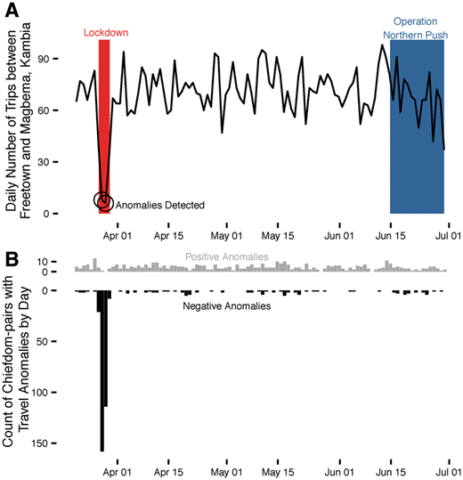

Research expanded to observe travel between all chiefdoms using the lagpanel function in R. Three samples of time were chosen for study: one period during the lockdown, and two control periods. Next, an anomaly detection algorithm measured deviations in the daily trip count between two given locations. Restriction size is measured by the equation:

**log Y(i,j),t = N(i,j),t + m (i,j),t + ε(i,j)**

with N representing no intervention, m representing intervention, and ε representing a random value to account for daily differences in traffic. Phone users were labeled based on the amount their signal traveled over each time frame. Finally, ArcGIS software helped calculate the distances between each cell tower. [1]

  Peak found that travel restrictions did a satisfactory job of slowing long-range travel within Sierra Leone’s borders. Table 1 illustrates the 76% decline in long-distance travel during the national lockdown. 

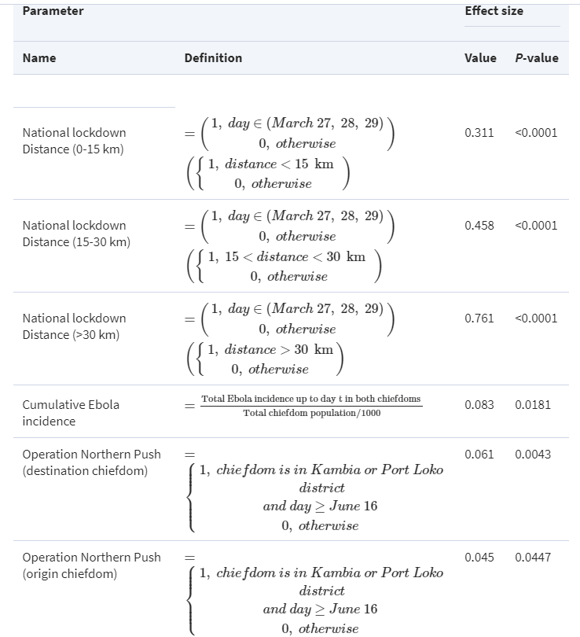

Furthermore, the average travel distance during the lockdown decreased from roughly 12.5 km during the control periods to just 3.3 km. However, Figure 2 reveals that Operation Northern Push was less successful, with roughly a 50% reduction in travel in the northern provinces, while Figure 3 suggests that the operation occurred far too late to have a meaningful impact on spread.

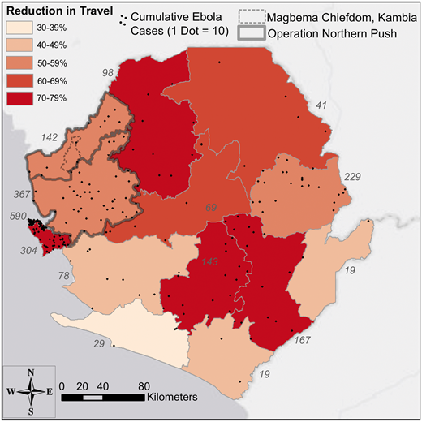
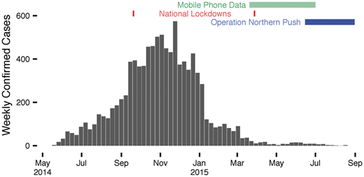

Peak’s team also noted that even for the national lockdown, travel anomalies varied widely across the country, with the strongest decrease in worse-affected areas. They found strong correlation among variables measuring distance travelled and proportion stationary in the pre- and post-lockdown control periods as shown in Table 2, suggesting that the lockdown may not have been long enough to adequately slow spread. 

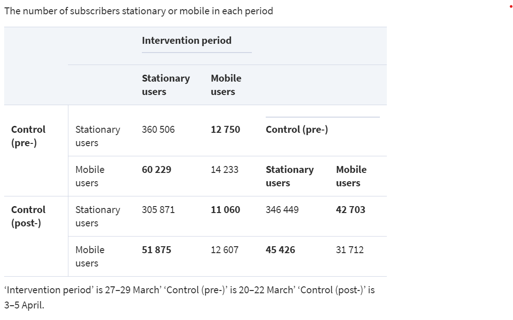

One complication to this dataset is the dearth of cell towers in rural regions compared to urban regions, potentially skewing the mobile phone data; this must be taken into account when evaluating the government response to the epidemic. On the other hand, socioeconomic status was concluded to not have a substantial impact on the data, reinforcing the applicability of this study to Liberia and Guinea. As a result, future study may be required to further determine spatial impacts on the poor.
  
  Another major issue in the fight against disease outbreaks is the economic burden placed upon low-middle income countries such as those that fought Ebola in West Africa. Mapping the costs of an epidemic allows for precise contingency planning in the event of a future outbreak. The Agency for Healthcare Research conducted a study to determine the average cost of treating a West African Ebola case to recovery, death, or either with extensive care, defined by the presence of bleeding, shock, or hallucination. Bartsch et al. utilized a temporal Monte Carlo simulation, allowing for the prediction of productivity losses as well as real cost. First, they examined Ebola treatment courses, generally defined by the WHO’s list of essential hemorrhagic fever medications. Next, they considered the costs of the personal protective equipment necessary to keep healthcare workers safe from infection; they determined that 16 patients per day could be seen in the extra time required to don PPE. Each simulation used 1000 patients with the full range of the variables listed in Table 3 below. 

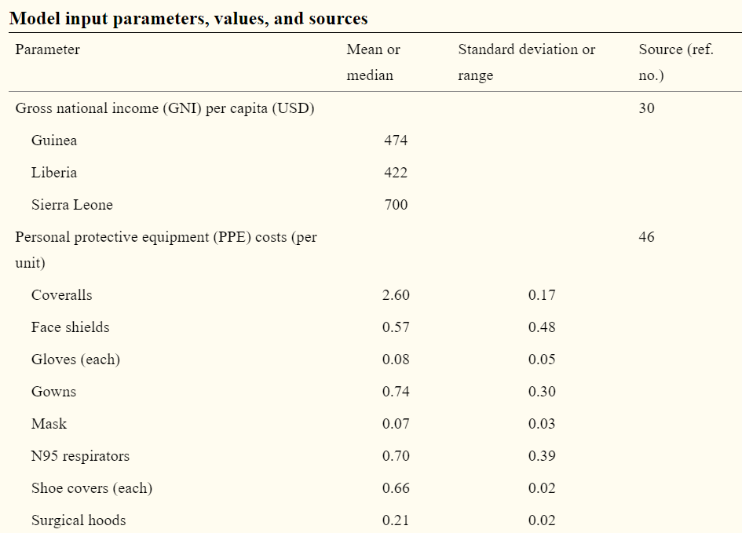
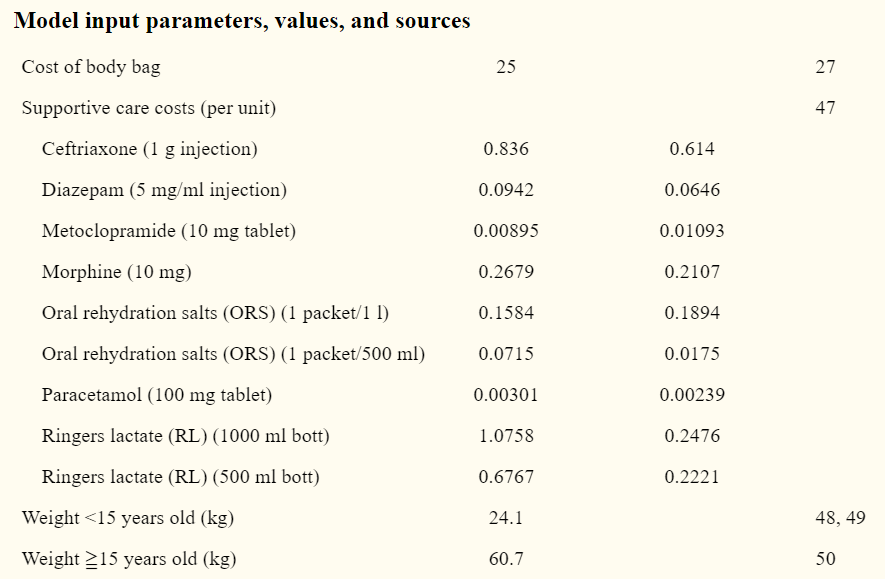
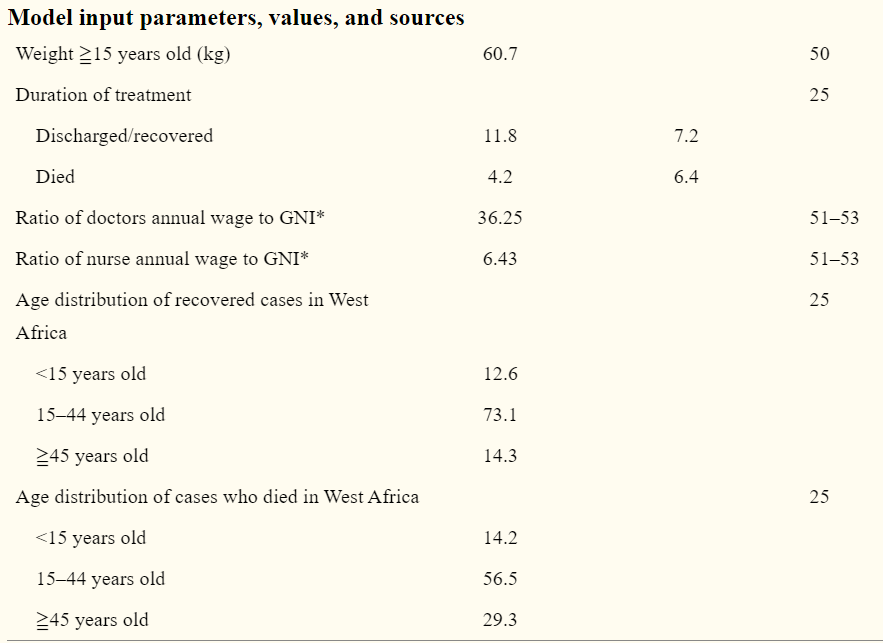

Table 3 further includes baseline cost data, converted to USD, for the essential tools of treatment in lieu of a specific formula. Bartsch and his team used publicly available data from other African nations including Senegal and Ghana to project the ratio of GNI to the wages of available healthcare workers. [2]
  
  Bartsch concluded that most monetary variations between the three countries resulted from GNI, with each nation reporting similar treatment costs. Table 4 displays the median costs split up by variables such as PPE for each country. 
  
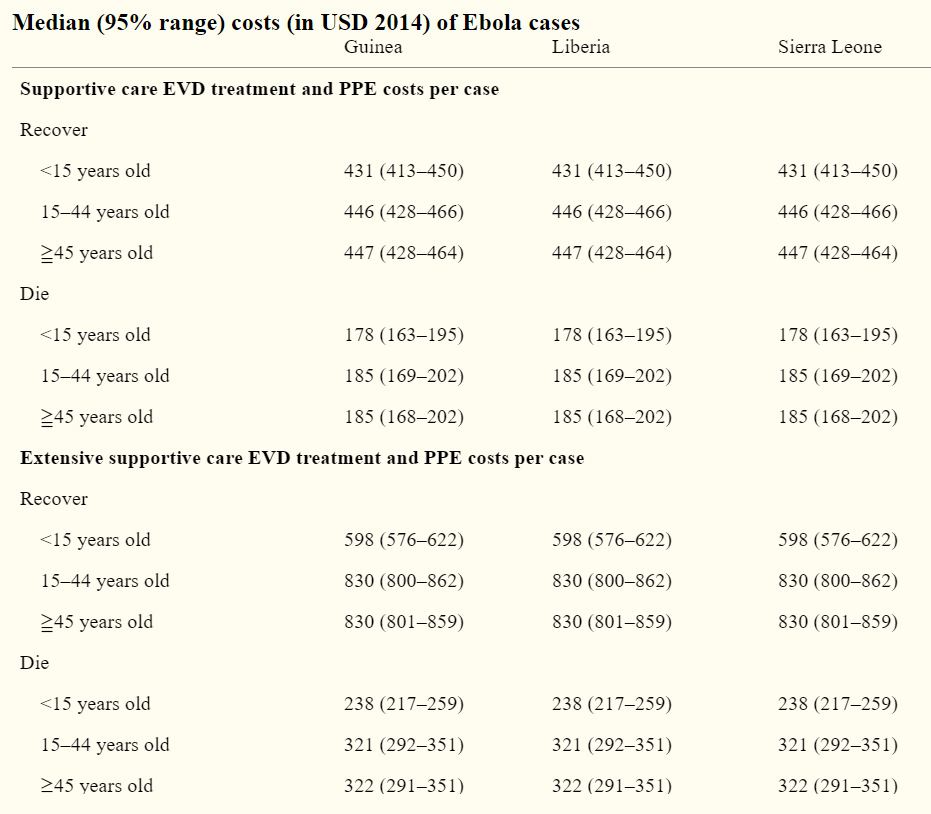
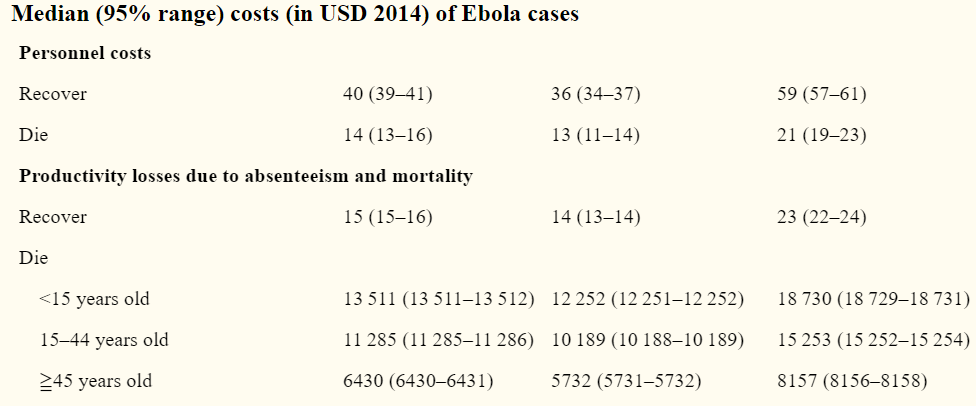
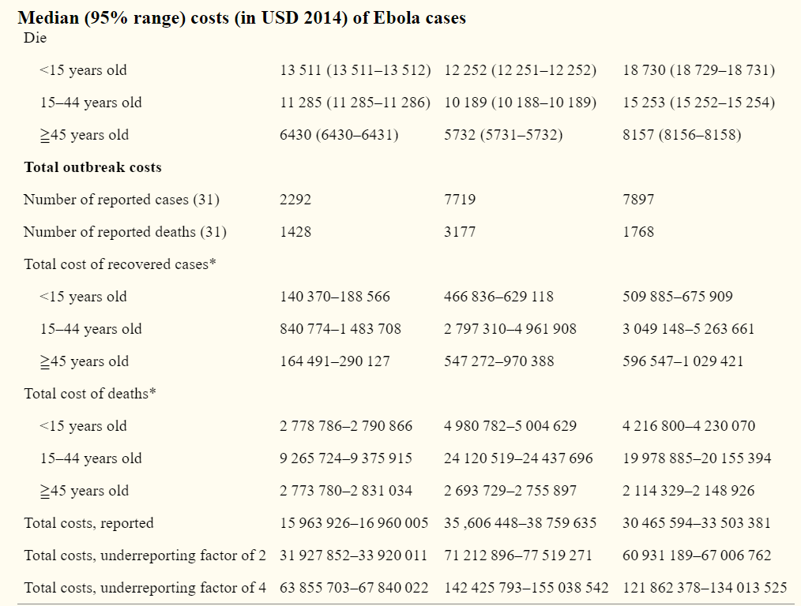
  
 Societal costs turned out much higher than real costs due to the opportunity cost of treatment, with this effect exacerbated among younger demographics. Additionally, Bartsch’s team determined that the true costs of the pandemic were at least double the returns from the model, since many cases in West Africa were not reported to the WHO. They determined that the typical Ebola case was more costly than measles yet less so than cholera, although the long-term aftereffects of the former disease were not accounted for. Bartsch’s model reveals that even with significant underreporting, Ebola was an economic catastrophe for an area already struggling with high poverty. Potential solutions to fix costs of a future outbreak include stipends to the population most at-risk financially in order to prevent total collapse, partially alleviating worries about the impact on the poor. Another solution could include allowing somewhat more flexibility regarding work for the young, who have the most to lose from a shutdown of production. They conclude by emphasizing the importance of cost models in highlighting the effectiveness of cost interventions, echoing the focus of this research on creating strong institutions within West African nations.

## Conclusion
  Both methods work to complement each other in deeming the adequacy of the reponse to Ebola. However, while the data presented on the effectiveness of government programs is quite detailed, it is not complete by any means. As previously mentioned, one limit to mobile phone data comes from the fact that cell phone towers are not evenly distributed, meaning that it is harder to measure the impact of travel restrictions on the rural population of West African countries. An additional data source that is more tailored toward these rural settlements must be found to register the true success or failure of lockdown measures. Another research gap among my methods is the underrepresentation of cases by the governments of the three hardest hit countries. The best solution to this problem is increasing testing capacity via either elevated government spending on healthcare or international aid. West Africa must use data to find ways to improve the response to Ebola, in order to prevent another virus from creating a new humanitarian crisis of the same scale, killing thousands more, and bringing nations near collapse.

## References
[1] Peak, Corey M., Wesolowski, A., zu Erbach-Schoenberg, E., et al. Population mobility reductions associated with travel restrictions during the Ebola epidemic in Sierra Leone: use of mobile phone data, International Journal of Epidemiology, Volume 47, Issue 5, October 2018, Pages 1562–1570, https://doi.org/10.1093/ije/dyy095

[2] Bartsch, S. M., Gorham, K., & Lee, B. Y. (2015, February). The cost of an Ebola case. Retrieved from https://www.ncbi.nlm.nih.gov/pmc/articles/PMC4445295/

