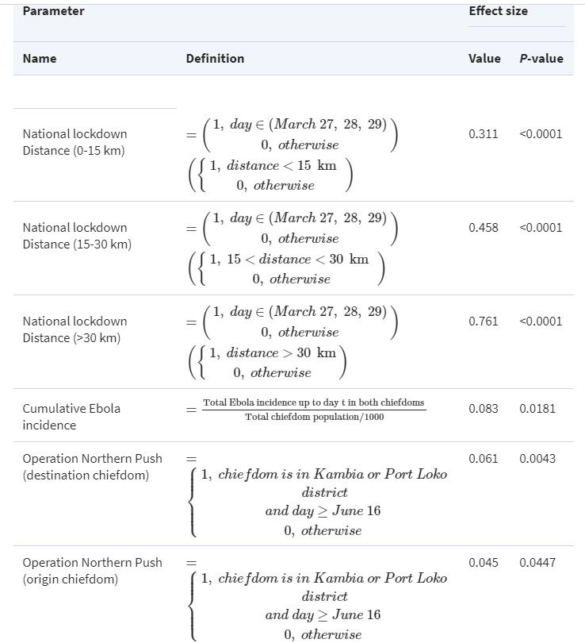
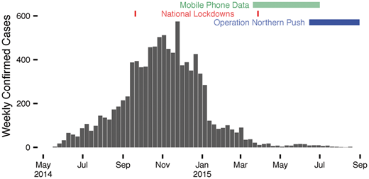
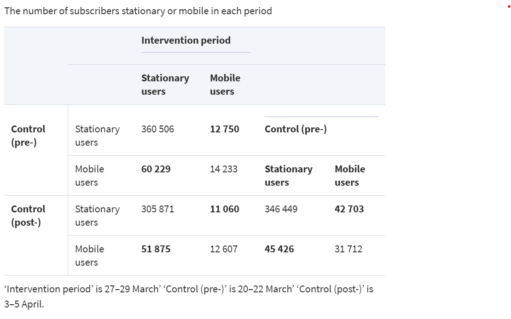

May 8, 2020
Matthew Rubin
World Health Organization
College of William and Mary

To whomever it may concern,

I am writing to urge you to deeply contemplate my plan regarding the rehabilitation of the Western African nations of Guinea, Liberia, and Sierra Leone in the aftermath of the worst Ebola epidemic in human history. The outbreak brought a humanitarian crisis to the region and in many ways these countries remain unprepared for the next outbreak to occur. In light of the coronavirus pandemic, I ask you to implement this plan as soon as possible.
  
My research focuses on building up healthcare infrastructure and public trust in government after a dearth of these contributed to the thousands of deaths caused by Ebola. Taking action has vital consequences for the entire world, as the need for international support led to Ebola spreading across the globe in isolated fashion. Support for rural areas without adequate access to health facilities is another huge concern with the new virus. Finally, cost and poverty must be addressed in an area ranked at the bottom of the world in human development.
  
Research methods used to analyze how the region’s governments can improve their responses focus mainly on human mobility. Cell phone data allows for reliable real-time analysis of how people are traveling within and between districts. Covariates for mobility can accurately predict the spread of disease with the use of a gravity model and a radiation model. Each of these methods displayed great promise during Ebola, but they must be adapted to address concerns such as lack of coverage for the poor and the previous absence of a dataset for mobility that is guaranteed to provide reliable results.
  
To solve these problems, I propose a multilayered idea that will provide a needed boost to West African societies. A council will be formed for each of the three countries, consisting of equal representation of each political party and independent health experts from around the world. This committee will be granted authority to build new hospitals in regions where healthcare is sporadic. Additionally, the council, with help from leaders at the local level, will create an education program that teaches populations about the importance of quarantine and trusting health officials in order to limit violence of the scale that was seen during Ebola. Finally, a quarantine bracelet program will allow for new opportunities to track mobility data and improve government strategy in real time. I believe this is the best way to ensure West African prosperity even in the face of crisis to ensure that no one is denied the human right that is health.
  
Sincerely, 

Matthew Rubin

# How Mobility Data Can Improve West African Healthcare and Prevent the Next Ebola
Matthew Rubin
Wordcount: 4966

## Problem Statement and Development Topic
Ebola helped to reveal the fragility of the healthcare systems in Guinea, Liberia, and Sierra Leone, in addition to the weakness of their central governments as a whole. Even before the beginning of the outbreak, healthcare was dangerously underdeveloped in the region, with Liberia holding just forty doctors and eight hospital beds for every 100,000 people [1]. Therefore, researchers should primarily emphasize the third United Nations sustainable development goal to strengthen West African standards of living. Additionally, the first and sixteenth sustainability goals must be considered when implementing solutions in these countries. High poverty rates in the region are representative of low levels of development, with all three countries ranked among the bottom 15 in the world by their Human Development Index [2]. Stronger institutions are necessary to manage a crisis for the entirety of their population, rather than a subset. For example, many rural areas across West Africa were less adherent to restrictions enacted during the crisis in large part due to the government’s inability to enforce them. Finally, the ninth sustainable development goal will help correct the precipitous lack of healthcare infrastructure, allowing each country to make better preparations for the next major epidemic to infect the region.

Disease control in West Africa has effects that can extend around the entire globe. The lack of necessary healthcare infrastructure in Sierra Leone, Guinea, and Liberia led hundreds of missionary workers to descend on the region, risking exposure to the virus to help aid others. This action, while undoubtedly saving countless lives, allowed the virus to spread to Europe and the United States, although their more robust healthcare systems did not allow Ebola to spread further. Government capability, on the other hand, has more of an impact on a regional level, but remains extremely important during a pandemic, as porous borders allowed Ebola to spread to neighboring countries such as Senegal and Mali, creating unnecessary panic for their citizens and havoc for their governments.

One complication to progress in treating Ebola came from the resistance of the people themselves, displaying an innate lack of trust in the authorities. Citizens were outraged when the government elected to ban traditional funerals along with rites such as washing the body before burial. As a result, they began to view the healthcare workers infringing upon their villages as an enemy representing crooked leadership, even when the workers were from international medical organizations like Doctors Without Borders. Some even reacted violently, attacking and injuring doctors and nurses and leading DWB to threaten to leave Guinea at one point. Uncertainty about reliable healthcare may have played a role in instigating the unrest, but at the end of the day, a strong government should be able to earn the respect of the people, or at least reassure them of the dangers of non-compliance enough to instill cooperation with foreigners. However, while the environment in some areas of the region may be hostile, other regions have shown great promise, particularly the larger cities where most citizens took the threat of Ebola very seriously according to the available data.
The dearth of human development, healthcare, and infrastructure within West Africa echoes the ideas proposed by Amartya Sen regarding freedom. Sen suggests that violence and upheaval are inevitable when the people feel that their beliefs and free will have been denied. Perhaps more importantly, the issue of public trust should be the foremost principle that guides the governance of a territory, regardless of size, wealth, and development level. Instances of corruption and bribery have made the desire to keep power the top priority for many bureaucrats in Guinea, Liberia, and Sierra Leone. Even while reliable healthcare remains physically inaccessible for many residents of these countries that live outside the most populated regions, in some ways it is inaccessible even for the wealthier aristocrats living in the capital cities. They feel so out of touch with their own leaders that making any advances for their communities is seemingly an uphill battle. The best way for a government to relax fear during a crisis is to act reassuringly and swiftly to quell threats to public safety while ensuring that the public’s personal values are not infringed upon.

Another point of contention comes from the apparent lack of urgency of the governments of Guinea, Sierra Leone, and Liberia in taking action to shut down checkpoints and border crossings. One of the most notable border incidents occurred in a triangular area surrounding the tripoint where the three countries meet each other.

This area spent many months as the most prevalent viral hotspot in West Africa, due in large part to a lack of checkpoints along the border between Liberia and Sierra Leone. By the beginning of August 2014, the area was responsible for 70% of cases in the entire outbreak [3]. Despite the slow but exponential growth in these provinces beginning in June, neither of the federal governments took any action to quarantine the area until August, when the military was sent in to “cordon” the triangle. Shutting down activity here could have prevented hundreds of cases from arising, greatly easing the strain on hospitals. In the event of a future epidemic, leaders need to act much more quickly and decisively in order to save as many lives as possible.

From a broad standpoint, healthcare in Guinea, Liberia, and Sierra Leone behaves as a complex adaptive system because of the many factors and variables in order to engineer solutions in a modern world. Part of the difficulty in engineering solutions to the problems faced by the region is the constant need for new technology as well as the manpower capable of maintaining it. For example, building and operating a new hospital in Liberia is unfeasible without technology necessary to sustain life on a basic level such as ventilators, or without the qualified staff to ensure wellness. If the resources to scale up hospitals in rural areas to the level of those in major cities are not available, an affordable minimum standard that meets the needs of all of the people must be found and implemented. Meanwhile, cities must be able to scale up their resources in order to meet their demand, as infectious diseases are often more prevalent and harmful in areas with high population density. The next big step forward is for other, less urban areas of the region to begin scaling up for the next epidemic. There is no question whether a new disease will hit West Africa, but rather when it will happen. If the governments can prepare in the short term for outbreaks in the future, they will see immense benefits to their nations and the livelihoods of their people in the long term.

Cost is another very important variable that must be accounted for when discussing the improvement of West African healthcare. A study carried out by researchers from the National Institutes of Health examined the costs of an Ebola case with the use of a Monte Carlo simulation, intending to aid Guinea, Liberia, and Sierra Leone with disease contingency planning [4]. Bartsch et al. considered the financial flexibility needed for a wide variety of items and conditions present during the outbreak from the basic treatment medications for Ebola based on estimates from the WHO to the daily costs of personal protective equipment. Below is a sample of their calculations:

Particularly noteworthy is the fact that Bartsch’s team based much of their research on the concept of opportunity cost, or how much money each country was losing in the time spent fighting Ebola. They found that each of the three countries reported fairly similar real costs from the outbreak, with most of the differences coming from gross national income. Bartsch notes that societal costs were actually much higher than actual costs, because the opportunity cost of treatment had such a drastic impact on younger demographics. Ebola cost the working class enough productivity to nearly trigger a recession in the region. Furthermore, the economic impact of the situation was magnified by the vast underreporting of cases, with medical experts cited by Bartsch believing that the true case numbers were double or triple the official ones. In order to adequately prepare their countries for a potential viral outbreak in the coming years, the governments of West African nations must take these monetary results into account when choosing how to invest in their healthcare systems and infrastructure.

In the aftermath of the epidemic, it does appear that at the very least, the government of Sierra Leone is doing their best to improve their healthcare situation, having signed a contract with a private partner to build three brand new hospitals across the country [5]. Each hospital is specialized to treat infectious diseases and deal with the symptoms that have been dubbed “post-Ebola syndrome” caused by residual fragments of the virus left in the body. This course of action may indicate a cause-and-effect relationship between cost and government action, as a private partnership is able to handle the burden of treatment much easier than the leadership of a developing country. While West Africa has taken steps in the right direction, there remains the most important question: how can governments regain the trust of the people?

## Geospatial Methods
In the years following the end of the Ebola outbreak in West Africa, researchers have produced several methods that strongly aid in evaluating the civil response to the epidemic. Each of these methods is specifically crafted for the purpose of evaluation, combining different elements of the impact of the virus on society to produce a big picture analysis of how Guinea, Sierra Leone, and Liberia did well and how they could have done better in fighting Ebola. Cell phone data and radiation models are the main geospatial methods utilized in this research. Each of these methods made substantial progress as a result of tracking the outbreak, but much room for improvement still remains for researchers.

Mobile phone data collected and disseminated by telecommunications companies in West Africa holds terrific promise for battling the next great pandemic. One post-Ebola study examined millions of phone records from Sierra Leonians during the outbreak using a combination of spatial and temporal data. To get a proper time frame, Peak et al. mapped the lockdown periods within Sierra Leone using WHO data, with the three-day national lockdown and the 21-day regional Operation Northern Push highlighted. They hashed the IDs of subscribers and generalized signal locations to cell towers in order to safeguard the privacy of customers. Peak’s team began their actual data collection process by measuring travel anomalies observed during the crisis for people traveling between the capital of Freetown and Magbema in the north of the country. [6]

Peak’s team then expanded their research in order to map travel between all “chiefdoms” using the lagpanel function in R. They chose three time samples to study the effects of lockdowns: one period during the lockdown and two control periods. Next, they employed an anomaly detection algorithm to measure deviations in the daily trip counts between two given locations, as displayed in Figure 1 above. To measure restriction size, they used the equation:

where N represents no intervention, m represents intervention, i and j portraying the two tested chiefdoms for travel, and ε displaying randomness to account for daily fluctuations in traffic. Phone users were labeled as ‘stationary’ if they never connected to a cell tower further than ten kilometers from the first tower they connected to, with the distance sometimes downscaled in high-density areas. Finally, ArcGIS software was used to calculate the distances between each cell tower.

Peak and his team found that broader travel restrictions did a satisfactory job of slowing long-range travel within most areas of Sierra Leone. Table 1 illustrates a decline of 76 percent in trips of over thirty kilometers during the country’s national lockdown.

Furthermore, the average travel distance during the national lockdown decreased to just 3.3 kilometers from roughly 12.5 kilometers during the control periods. However, Figure 2 reveals that Operation Northern Push was much less successful, with roughly a 50% reduction in travel in the northern provinces where it was enacted, while Figure 3 suggests that the operation occurred far too late to have any meaningful impact on spread.

Peak and his team also noted that even during the national lockdown, travel anomalies varied widely, with the strongest decrease in movement in worse-affected and densely populated areas. They found strong correlation among variables measuring distance travelled and proportion stationary in the pre- and post-lockdown periods as shown in Table 2 below, suggesting that the lockdown did not persuade many Sierra Leonians to remain at home until the outbreak subsided.

Peak makes the claim that socioeconomic status is not a major factor in cell phone data. However, enough doubt remains that this study should not be the sole basis for determining the next steps in West Africa. The potential to distort the impact on the poor is high enough that other methods should be used in conjunction with cell phone data, even as it rapidly gains traction in studies around the world as a reliable form of transportation analysis.

Another study carried out by Kraemer et al. employs a radiation model to similarly focus on how the timing and efficiency of lockdowns affected human mobility variables. According to Kraemer, this is the first study about Ebola involving general human mobility models, as others did not measure aspects such as the contribution of cases from each district over time. They incorporate existing mobile phone data from Europe and Senegal to examine how transmission occurred within and between districts. [7]

Kraemer’s team began by collecting case data from the World Health Organization. They utilized three models to predict movements between districts in the three countries due to a lack of existing human mobility data: a gravity model, a radiation model, and an adjacency network. In each of the following equations, Ti,j represents the number of individuals moving from district ‘i’ to district ‘j’; Njα  represents population size at the origin; Njβ  is population size at the destination; di,jγ  displays the distance between the locations; and si,j portrays the population living within the radius between i and j. Each of the Greek letters correspond to data from Europe and Senegal, fitted with the use of Poisson regression.

In Figure 4 below, image A represents the gravity model, while B shows second-degree adjacent districts and C displays case counts by district.

The gravity model emphasizes the “attraction” of large urban areas by assuming that relative flow between them serves as a mixture between a logarithm and a linear function. The radiation model, on the other hand, takes into account populations within the same radius, reflecting suburbanites traveling to work in the city. Finally, adjacency networks project the number of borders one needs to cross to move between districts, helping to reflect the impact of boundaries on mobility. These models were used in conjunction by Kraemer’s team to observe whether any unforeseen effects would arise. Each model was “trained” against supplemental mobile phone data from Europe and Senegal because of a lack of available West African data.
Using the optim function and the BFGS method, they optimalized each movement’s parameters to compare them to results from mobile phone data based on each nation’s census.

For each district, Kraemer’s team first found the population size for each district, then applied the parameters for the gravity and radiation models. They next computed the national adjacency networks using GADM boundary data, then split up pairs of districts by their degree of separation. Candidate covariates helped capture spatial interactions using backward selection via the “step” function of R, attempting to nullify errors from generalization. Finally, the data was split up by country and by district. To map the spread of disease, a two-stage model helped to map both geography and projected secondary cases. The first step involved an invasion model where Yi(t) indicated new cases, C-i(t-1) represented new cases in all other districts for the past two weeks, and all other variables indicated covariates.

The second step utilized a transmission model with It,i as the number of infected people; St-1 as the number of susceptible people; Ni as population, εt,i as randomly distributed error terms, and βt,i as mobility rate derived from covariates.

Finally, Kraemer’s team calculated which districts had the highest contributions to transmission by converting Equation 2 above into a linear regression. Figure 5 below shows the results of these calculations:

Kraemer and his team found that their mobility model was very strong at explaining a large number of the tested covariates. Using the human mobility matrices from the European data greatly improved predictions for case incidence within the following two week period. Figure 6 maps the observed cases against predicted transmission overall and in Guinea, Liberia, and Sierra Leone, respectively.

The mobility model certainly succeeded in improving the accuracy of case predictions throughout the region. In Guinea, the addition of covariates improved reporting accuracy by 22%. Liberia’s specific mobility matrix model was also more precise, with indications of very high local transmission, and Sierra Leone reported similar results. Kraemer also noted how the outbreak seemed to shift over time from the initial area of outbreak in Guinea to the heavily populated corridor along the Atlantic coast. The team emphasizes the importance of strong border controls in halting an epidemic by noting that while only one county, Nimba in Liberia, was a major source of spread along an unaffected border, most boundary districts served as transmission sinks. Changing the “mixing coefficient” for each country did not significantly impact the results.

Kraemer argues that mobility models like these are critical to rapidly assess the spread of disease. His team proved that outbreaks see a change in lineage as well as transmission sinks throughout the course of the entire epidemic, as previously corroborated by genome data. Additionally, he describes how the models can be updated as needed for public interest during an outbreak. Kraemer further notes that human movement data did not significantly aid projections in the second half of the Ebola outbreak. However, he argues that covariates become less important once the virus has become established in every district. The team concludes by noting that they continued tracking the decline in cases once distancing strategies became encouraged, but did not include all possible combinations of mobility metrics.

## Literature Gap
The biggest complication with the Peak dataset is the dearth of cell towers in rural provinces and districts compared to urban ones. This inequality must be considered when evaluating the results of the government response to the epidemic. Another issue is the loose definition of what may be considered a “trip”, as well as the possibility that civilians may travel without a cell phone on their person. While Peak’s team found that socioeconomic status was not a major factor regarding travel patterns, poverty creates selection bias for the data as the poor are generally less likely to own a mobile phone. Finally, there is the possibility that the lockdown interfered with data from the control periods, as even the time period immediately before and after a shutdown can help suppress travel.

One potential shortcoming of Kraemer’s analysis is the data’s lack of a method to count the number of people actually traveling between two locations as opposed to relative flow methods. However, Kraemer claims that doing so would not significantly alter the covariate data, as the model could still predict the spread of the pathogen over time. Additionally, there is the question of whether the data taken from Europe and Senegal provides a fair representation of the West African countries for which its use is intended. Developed countries and developing countries tend to have very different lifestyles and social dynamics, so the data may not be fully accurate. Most importantly, this data does not consider the effects of government limitations, unlike the Peak data. Kraemer’s research team should collaborate with the governments of Guinea, Liberia, and Sierra Leone to ensure that their data is as reliable as possible for the next epidemic. With this gap in mind, the main research question to consider is: how can phone data and mobility models help West African governments peacefully and effectively encourage and enforce social distancing measures to mitigate the next big epidemic?

## Research Plan
This research attempts to continue the process of evaluation while additionally seeking new data sources to fill the holes left by previous methods. The ongoing coronavirus pandemic provides a perfect opportunity to collect additional information to strengthen West African institutions. My solution involves a series of coronavirus outreach programs as well as low-cost tracking methods that should address the research gaps formed by lack of phone coverage and shortcomings of rural parts of Guinea, Sierra Leone, and Liberia. I hypothesize that a strong viral education campaign, particularly targeting cultural events such as funerals, will greatly reduce the virology of COVID-19 within West Africa. Combined with this campaign is a remote quarantine tracker program, which will aid the governments in quarantine enforcement while immensely lowering healthcare expenditures and reducing the number of cases even among the poorest communities. Furthermore, this endeavor will reduce the cost paid by citizens as part of the burden for treatment and provide greater accuracy for data measurements of legislative efficiency as it should cover the entire population equally.

With the implementation of viral literacy programs and bracelet trackers, I intend to keep cases of coronavirus to under half the cases that West Africa saw during Ebola. Doing so will relieve stress on already fragile healthcare systems and prevent them from becoming overwhelmed with cases as they were during the previous epidemic. I believe that this plan will lead to nearly everyone in Guinea, Sierra Leone, and Liberia being better off than they were before; however, completing this research plan will require cooperation and coordination from a number of parties. While each government should run the program with the help of a council of leaders from major parties, international organizations such as the WHO and CDC should help brief them on the steps they need to take and provide some of the resources such as potential quarantine trackers.

The first step toward completing my plan will involve mass production of wristbands with microchips that can more effectively track location data than mobile phones, especially in cities. Some of this production should take place in Liberia, where rubber is one of the top exports. Meanwhile, each nation’s health department must create a program that educates citizens on the importance of following quarantines. Funerals and other important cultural rites should not be banned as they were during Ebola, but instead limited to just immediate family members unless they are either confirmed positive or confirmed to have been exposed to the virus. I believe that this will lead to drastic improvements in the mobility models that have already been developed and will also become an impetus for the use of new high-resolution mapping techniques to help stop infectious diseases. In order to collect the actual data for the mobility models, a two-week quarantine tracking program will be utilized with the help of electronic bracelets, similar to the ones used in Hong Kong during the coronavirus outbreak. This program will be fully optional so that researchers can limit the risk of violent outbursts from citizens unwilling to participate.

Completing this research should definitively reveal whether the governments of Guinea, Liberia, and Sierra Leone have learned from their Ebola mistakes and successfully taken steps to improve their crisis management. I anticipate that most bottlenecks and slowdowns in the process will come from delays in the resources needed to run a massive education and quarantine tracking program. Additionally, these programs will likely be revisited in a decade or so to judge their success, likely by polling the population on whether they feel the government has taken steps to ensure that they are healthier and whether they believe they have safe, reliable access to healthcare. In this instance, utilizing the opinion of the people is the best way to measure whether the data on government efficiency is being applied to the proper aspects of society. 

Furthermore, in order to prevent corruption, a leadership council featuring natives of the three countries will be formed. This council will be split into three sections, one for each country, with each section having jurisdiction over their own territory. To select members of this council, each of the two biggest political parties in the three nations will nominate one of their leaders, ensuring equal representation of the views of the two sides. In Liberia, where the opposition is formed by a coalition [8], this process will apply to the party with the second highest proportion of the popular vote. However, the council will include neutral arbiters from the WHO to ensure that sectionalism, bribery, or decisions not made in the best interest of the people do not result.

My plan should be chosen because it is cost-efficient and it solves many of the problems that sprung up during Ebola without being too intrusive on the lives of the people. Privacy concerns can be mitigated with the use of waivers, so that subjects know of the tracking software and are less likely to be hostile. This plan will feature data methods with extremely high accuracy that have been proven to return results even in the chaotic environment of a large-scale epidemic. While other plans relating to disease control in low-middle income African countries have been proposed, I do not feel that they will produce a better combination of high-resolution spatial data and real-world benefits to the daily lives of citizens. For example, plans that involve directly appealing to the governments for legislation will not be as successful, since they will represent the doctrine of the parties in power regarding healthcare rather than what is best for everyone. Rather, the views of politicians on creating health infrastructure must pass the test of some of the world’s foremost medical experts before they become law. Hospitals must be built to maximize the number of people who can receive treatment while ensuring no one is left out.

Of course, I do anticipate several objections to appear to this plan, but I feel that all concerns can be resolved and the research can get into action quickly. I have already addressed how getting the approval of participants for the quarantine tracker study can alleviate most concerns about privacy. While some may have legitimate concerns that the structure of the councils may turn this exercise into a political shouting match, I have faith that the independent medical leaders will be able to keep things on topic and produce an effective rural education program. Lastly, the council can help the country rebuild economically in order to fund the building of new infrastructure by hiring the jobless in the big cities for construction, hopefully averting the need to contract all of their workers from abroad.

In terms of finances, the plan will vary depending on what the council decides regarding the construction of new healthcare facilities. I intend to receive funding from and establish partnerships with the WHO, CDC, and NIH, all of which have serious interest in helping West Africa post-Ebola. Assuming that each country decides to construct two new hospitals, I estimate that the final cost of the research portion of the project will be less than $2 million. A study conducted before the start of the Ebola outbreak estimated that the cost of a new hospital in Sierra Leone would be roughly $250,000 [9]. Due to the similar states of the economies of Liberia and Guinea in comparison, we should expect the expense of building a facility from the ground up to be roughly the same for Sierra Leone’s neighbors. This assumes that each hospital is one to two stories tall and contains roughly 450 beds. Each hospital will be built based on the areas of need in the three countries, with heavy weight placed on areas whose residents do not currently have a reliable health center within an hour of their homes. 

I do not anticipate that the cost of the viral education program in rural areas will be higher than about $50,000. Most of the additional expenses from that aspect will come from supply costs such as the printing of flyers. One possibly beneficial system to increase the reliability of this system would be an offer of a small stipend to leaders at the local level for giving presentations on material provided by the council. This will ensure that people have someone trustworthy to listen to and increases the likelihood that the epidemic will see a reduced number of cases. Finally, the cost of the actual data collection should be very minimal as well. A large amount of the additional mobility data will be simple to aggregate once it is collected. The quarantine tracker devices can be easily applied to the existing gravity and radiation models once each subject’s two week period has passed. Many of the variables used to track mobility can be reapplied to this new study, with the covariates largely remaining the same.

Choosing this plan will provide the healthiest, strongest, and brightest future for Guinea, Liberia, and Sierra Leone. Healthcare is a fundamental right that every person should have physical access to. A mixture of a public and private system, coupled with increased awareness and knowledge from mobility programs, will be of immense value to West Africa when they face the same fears that they did during Ebola. With coronavirus now upon us, hopefully this plan can and will be put into action immediately.

## References
[1] GHO / By country / Liberia - statistics summary (2002 - present). (2020, March 10). Retrieved from https://apps.who.int/gho/data/node.country.country-LBR?lang=en

[2] Conceicao, P. et al. (2019). United Nations Human Development Report 2019. Retrieved from http://hdr.undp.org/sites/default/files/hdr_2019_overview_-_english.pdf

[3] Mcneil, D. G. (2014, August 13). Using a Tactic Unseen in a Century, Countries Cordon Off Ebola-Racked Areas. Retrieved from https://www.nytimes.com/2014/08/13/science/using-a-tactic-unseen-in-a-century-countries-cordon-off-ebola-racked-areas.html

[4] Bartsch, S. M., Gorham, K., & Lee, B. Y. (2015, February). The cost of an Ebola case. Retrieved from https://www.ncbi.nlm.nih.gov/pmc/articles/PMC4445295/

[5] Partners in Health: Sierra Leone. (2020). Retrieved from https://www.pih.org/country/sierra-leone

[6] Peak, Corey M., Wesolowski, A., zu Erbach-Schoenberg, E., et al. Population mobility reductions associated with travel restrictions during the Ebola epidemic in Sierra Leone: use of mobile phone data, International Journal of Epidemiology, Volume 47, Issue 5, October 2018, Pages 1562–1570, https://doi.org/10.1093/ije/dyy095

[7] Kraemer, M. U. G., Golding, N., Bisanzio, D., et al. (2019, March 26). Utilizing general human movement models to predict the spread of emerging infectious diseases in resource poor settings. Retrieved from https://www.nature.com/articles/s41598-019-41192-3

[8] Senkpeni, A. D. (2019, February 21). Liberia: Four Leading Opposition Parties Form a United Front. Retrieved from https://frontpageafricaonline.com/politics/liberia-alliance-of-four-political-parties-raises-concerns-of-failed-past-mergers/

[9] Grimes, C. E., Law, R., Dare, A., et al. (2017, March 27). Cost-Effectiveness of Two Government District Hospitals in Sub-Saharan Africa. Retrieved from https://www.ncbi.nlm.nih.gov/pmc/articles/PMC5544794/
