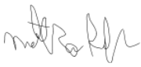
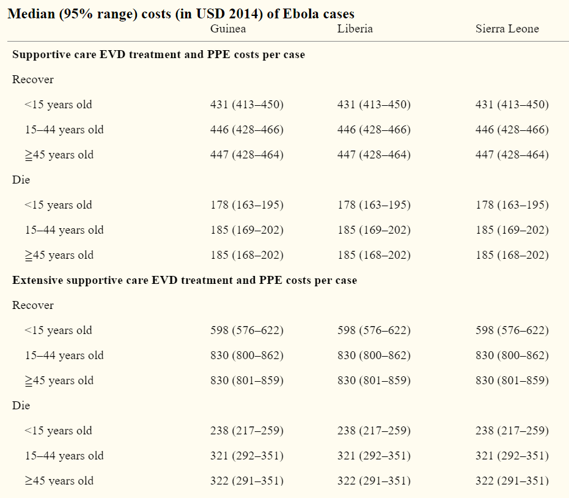

May 8, 2020
Matthew Rubin
World Health Organization
College of William and Mary

To whomever it may concern,

I am writing to urge you to deeply contemplate my plan regarding the rehabilitation of the Western African nations of Guinea, Liberia, and Sierra Leone in the aftermath of the worst Ebola epidemic in human history. The outbreak brought a humanitarian crisis to the region and in many ways these countries remain unprepared for the next outbreak to occur. In light of the coronavirus pandemic, I ask you to implement this plan as soon as possible.
  
My research focuses on building up healthcare infrastructure and public trust in government after a dearth of these contributed to the thousands of deaths caused by Ebola. Taking action has vital consequences for the entire world, as the need for international support led to Ebola spreading across the globe in isolated fashion. Support for rural areas without adequate access to health facilities is another huge concern with the new virus. Finally, cost and poverty must be addressed in an area ranked at the bottom of the world in human development.
  
Research methods used to analyze how the region’s governments can improve their responses focus mainly on human mobility. Cell phone data allows for reliable real-time analysis of how people are traveling within and between districts. Covariates for mobility can accurately predict the spread of disease with the use of a gravity model and a radiation model. Each of these methods displayed great promise during Ebola, but they must be adapted to address concerns such as lack of coverage for the poor and the previous absence of a dataset for mobility that is guaranteed to provide reliable results.
  
To solve these problems, I propose a multilayered idea that will provide a needed boost to West African societies. A council will be formed for each of the three countries, consisting of equal representation of each political party and independent health experts from around the world. This committee will be granted authority to build new hospitals in regions where healthcare is sporadic. Additionally, the council, with help from leaders at the local level, will create an education program that teaches populations about the importance of quarantine and trusting health officials in order to limit violence of the scale that was seen during Ebola. Finally, a quarantine bracelet program will allow for new opportunities to track mobility data and improve government strategy in real time. I believe this is the best way to ensure West African prosperity even in the face of crisis to ensure that no one is denied the human right that is health.
  
Sincerely, 

Matthew Rubin

# How Mobility Data Can Improve West African Healthcare and Prevent the Next Ebola
Matthew Rubin
Wordcount: 4966

## Problem Statement and Development Topic
Ebola helped to reveal the fragility of the healthcare systems in Guinea, Liberia, and Sierra Leone, in addition to the weakness of their central governments as a whole. Even before the beginning of the outbreak, healthcare was dangerously underdeveloped in the region, with Liberia holding just forty doctors and eight hospital beds for every 100,000 people [1]. Therefore, researchers should primarily emphasize the third United Nations sustainable development goal to strengthen West African standards of living. Additionally, the first and sixteenth sustainability goals must be considered when implementing solutions in these countries. High poverty rates in the region are representative of low levels of development, with all three countries ranked among the bottom 15 in the world by their Human Development Index [2]. Stronger institutions are necessary to manage a crisis for the entirety of their population, rather than a subset. For example, many rural areas across West Africa were less adherent to restrictions enacted during the crisis in large part due to the government’s inability to enforce them. Finally, the ninth sustainable development goal will help correct the precipitous lack of healthcare infrastructure, allowing each country to make better preparations for the next major epidemic to infect the region.

Disease control in West Africa has effects that can extend around the entire globe. The lack of necessary healthcare infrastructure in Sierra Leone, Guinea, and Liberia led hundreds of missionary workers to descend on the region, risking exposure to the virus to help aid others. This action, while undoubtedly saving countless lives, allowed the virus to spread to Europe and the United States, although their more robust healthcare systems did not allow Ebola to spread further. Government capability, on the other hand, has more of an impact on a regional level, but remains extremely important during a pandemic, as porous borders allowed Ebola to spread to neighboring countries such as Senegal and Mali, creating unnecessary panic for their citizens and havoc for their governments.

One complication to progress in treating Ebola came from the resistance of the people themselves, displaying an innate lack of trust in the authorities. Citizens were outraged when the government elected to ban traditional funerals along with rites such as washing the body before burial. As a result, they began to view the healthcare workers infringing upon their villages as an enemy representing crooked leadership, even when the workers were from international medical organizations like Doctors Without Borders. Some even reacted violently, attacking and injuring doctors and nurses and leading DWB to threaten to leave Guinea at one point. Uncertainty about reliable healthcare may have played a role in instigating the unrest, but at the end of the day, a strong government should be able to earn the respect of the people, or at least reassure them of the dangers of non-compliance enough to instill cooperation with foreigners. However, while the environment in some areas of the region may be hostile, other regions have shown great promise, particularly the larger cities where most citizens took the threat of Ebola very seriously according to the available data.
The dearth of human development, healthcare, and infrastructure within West Africa echoes the ideas proposed by Amartya Sen regarding freedom. Sen suggests that violence and upheaval are inevitable when the people feel that their beliefs and free will have been denied. Perhaps more importantly, the issue of public trust should be the foremost principle that guides the governance of a territory, regardless of size, wealth, and development level. Instances of corruption and bribery have made the desire to keep power the top priority for many bureaucrats in Guinea, Liberia, and Sierra Leone. Even while reliable healthcare remains physically inaccessible for many residents of these countries that live outside the most populated regions, in some ways it is inaccessible even for the wealthier aristocrats living in the capital cities. They feel so out of touch with their own leaders that making any advances for their communities is seemingly an uphill battle. The best way for a government to relax fear during a crisis is to act reassuringly and swiftly to quell threats to public safety while ensuring that the public’s personal values are not infringed upon.

Another point of contention comes from the apparent lack of urgency of the governments of Guinea, Sierra Leone, and Liberia in taking action to shut down checkpoints and border crossings. One of the most notable border incidents occurred in a triangular area surrounding the tripoint where the three countries meet each other.

This area spent many months as the most prevalent viral hotspot in West Africa, due in large part to a lack of checkpoints along the border between Liberia and Sierra Leone. By the beginning of August 2014, the area was responsible for 70% of cases in the entire outbreak [3]. Despite the slow but exponential growth in these provinces beginning in June, neither of the federal governments took any action to quarantine the area until August, when the military was sent in to “cordon” the triangle. Shutting down activity here could have prevented hundreds of cases from arising, greatly easing the strain on hospitals. In the event of a future epidemic, leaders need to act much more quickly and decisively in order to save as many lives as possible.

From a broad standpoint, healthcare in Guinea, Liberia, and Sierra Leone behaves as a complex adaptive system because of the many factors and variables in order to engineer solutions in a modern world. Part of the difficulty in engineering solutions to the problems faced by the region is the constant need for new technology as well as the manpower capable of maintaining it. For example, building and operating a new hospital in Liberia is unfeasible without technology necessary to sustain life on a basic level such as ventilators, or without the qualified staff to ensure wellness. If the resources to scale up hospitals in rural areas to the level of those in major cities are not available, an affordable minimum standard that meets the needs of all of the people must be found and implemented. Meanwhile, cities must be able to scale up their resources in order to meet their demand, as infectious diseases are often more prevalent and harmful in areas with high population density. The next big step forward is for other, less urban areas of the region to begin scaling up for the next epidemic. There is no question whether a new disease will hit West Africa, but rather when it will happen. If the governments can prepare in the short term for outbreaks in the future, they will see immense benefits to their nations and the livelihoods of their people in the long term.

Cost is another very important variable that must be accounted for when discussing the improvement of West African healthcare. A study carried out by researchers from the National Institutes of Health examined the costs of an Ebola case with the use of a Monte Carlo simulation, intending to aid Guinea, Liberia, and Sierra Leone with disease contingency planning [4]. Bartsch et al. considered the financial flexibility needed for a wide variety of items and conditions present during the outbreak from the basic treatment medications for Ebola based on estimates from the WHO to the daily costs of personal protective equipment. Below is a sample of their calculations:

Particularly noteworthy is the fact that Bartsch’s team based much of their research on the concept of opportunity cost, or how much money each country was losing in the time spent fighting Ebola. They found that each of the three countries reported fairly similar real costs from the outbreak, with most of the differences coming from gross national income. Bartsch notes that societal costs were actually much higher than actual costs, because the opportunity cost of treatment had such a drastic impact on younger demographics. Ebola cost the working class enough productivity to nearly trigger a recession in the region. Furthermore, the economic impact of the situation was magnified by the vast underreporting of cases, with medical experts cited by Bartsch believing that the true case numbers were double or triple the official ones. In order to adequately prepare their countries for a potential viral outbreak in the coming years, the governments of West African nations must take these monetary results into account when choosing how to invest in their healthcare systems and infrastructure.

In the aftermath of the epidemic, it does appear that at the very least, the government of Sierra Leone is doing their best to improve their healthcare situation, having signed a contract with a private partner to build three brand new hospitals across the country [5]. Each hospital is specialized to treat infectious diseases and deal with the symptoms that have been dubbed “post-Ebola syndrome” caused by residual fragments of the virus left in the body. This course of action may indicate a cause-and-effect relationship between cost and government action, as a private partnership is able to handle the burden of treatment much easier than the leadership of a developing country. While West Africa has taken steps in the right direction, there remains the most important question: how can governments regain the trust of the people?

## Geospatial Methods
In the years following the end of the Ebola outbreak in West Africa, researchers have produced several methods that strongly aid in evaluating the civil response to the epidemic. Each of these methods is specifically crafted for the purpose of evaluation, combining different elements of the impact of the virus on society to produce a big picture analysis of how Guinea, Sierra Leone, and Liberia did well and how they could have done better in fighting Ebola. Cell phone data and radiation models are the main geospatial methods utilized in this research. Each of these methods made substantial progress as a result of tracking the outbreak, but much room for improvement still remains for researchers.

Mobile phone data collected and disseminated by telecommunications companies in West Africa holds terrific promise for battling the next great pandemic. One post-Ebola study examined millions of phone records from Sierra Leonians during the outbreak using a combination of spatial and temporal data. To get a proper time frame, Peak et al. mapped the lockdown periods within Sierra Leone using WHO data, with the three-day national lockdown and the 21-day regional Operation Northern Push highlighted. They hashed the IDs of subscribers and generalized signal locations to cell towers in order to safeguard the privacy of customers. Peak’s team began their actual data collection process by measuring travel anomalies observed during the crisis for people traveling between the capital of Freetown and Magbema in the north of the country. [6]

Peak’s team then expanded their research in order to map travel between all “chiefdoms” using the lagpanel function in R. They chose three time samples to study the effects of lockdowns: one period during the lockdown and two control periods. Next, they employed an anomaly detection algorithm to measure deviations in the daily trip counts between two given locations, as displayed in Figure 1 above. To measure restriction size, they used the equation:

